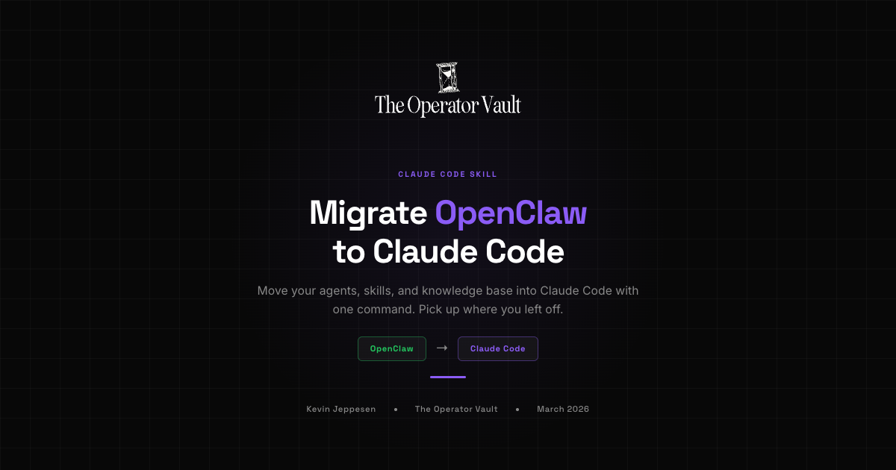

<p align="center">
  
</p>

<p align="center">
  A Claude Code skill that migrates your entire OpenClaw workspace into a fully functional Claude Code project.
</p>

---

If you've been running OpenClaw and want to switch to Claude Code, this skill handles the full migration. It scans your OpenClaw directory, shows you a preview of what will happen, and executes on your confirmation.

## What it does

- **Converts your agents into Claude Code skills** - each agent's personality (SOUL.md) becomes an invokable skill
- **Preserves your knowledge base** - USER.md, SOUL.md, IDENTITY.md, memory files all migrate to a clean `KNOWLEDGE BASE/` directory
- **Cleans your operating rules** - strips OpenClaw-specific stuff (heartbeat, gateway commands, channel routing) while keeping your universal rules
- **Migrates your custom skills** - OpenClaw skills convert directly to Claude Code skills (same markdown format, just strips OpenClaw metadata)
- **Generates a lean CLAUDE.md** - references your knowledge base files without inlining everything
- **Archives infrastructure files** - gateway config, credentials, session logs, etc. go to `_openclaw_archive/` so nothing is lost

## Installation

Add this skill to your Claude Code project:

```bash
# Clone into your .claude/skills/ directory
git clone https://github.com/Kevjade/migrate-openclaw.git .claude/skills/migrate-openclaw
```

Or manually copy `SKILL.md` into `.claude/skills/migrate-openclaw/SKILL.md` in your project.

## Usage

Once installed, just tell Claude:

```
migrate openclaw
```

Or any of these:
- "openclaw to claude code"
- "convert openclaw"
- "import openclaw"
- "switch from openclaw"

The skill supports three input methods:

1. **Copy your OpenClaw workspace into your Claude Code project** and run the skill
2. **Point to your local `~/.openclaw/` directory** - the skill auto-detects it
3. **Provide a GitHub repo URL** - if your OpenClaw workspace is in a repo

## What happens to your files

| OpenClaw | Claude Code |
|----------|-------------|
| `SOUL.md` | `KNOWLEDGE BASE/soul.md` (on-demand, not auto-loaded) |
| `USER.md` | `KNOWLEDGE BASE/user.md` |
| `AGENTS.md` | `KNOWLEDGE BASE/rules.md` (cleaned) |
| `IDENTITY.md` | `KNOWLEDGE BASE/identity.md` |
| `memory/*.md` | `KNOWLEDGE BASE/memory/` |
| Custom skills | `.claude/skills/` (converted) |
| Secondary agents | `.claude/skills/<agent-name>/` (personality as skill) |
| Gateway config, credentials, logs | `_openclaw_archive/` |

## After migration

Your Claude Code project will have:
- A `KNOWLEDGE BASE/` folder with all your context files
- A `CLAUDE.md` that references everything
- Your custom skills in `.claude/skills/`
- Agent personalities as invokable skills
- An `_openclaw_archive/` folder you can delete when ready

## What doesn't carry over

- **Channel integrations** (WhatsApp, Telegram, Discord) - Claude Code operates via terminal/IDE
- **Heartbeat/cron jobs** - no native equivalent in Claude Code
- **Multi-agent routing** - you invoke agent skills directly instead
- **Soul auto-injection** - personality is on-demand, read it when you need it

---

## About the Author

**Kevin Jeppesen** - Founder of [The Operator Vault](https://theoperatorvault.io/) and [Ascendily](https://ascendily.com).

7+ years in SEO and DTC eCommerce. Built Ascendily into a performance SEO agency managing $67M+ in revenue for clients. Now building The Operator Vault to teach founders, creators, and solopreneurs how to automate their businesses with AI agents using Claude Code and OpenClaw.

The Operator Vault community has 300+ members learning to build real automations. Free courses, weekly live calls, shared workflows, and direct help when you get stuck.

### Connect

- [YouTube](https://www.youtube.com/@kevin-jeppesen)
- [X / Twitter](https://x.com/seo_ecom)
- [LinkedIn](https://www.linkedin.com/in/kevin-jeppesen/)
- [Instagram](https://www.instagram.com/kevin_jeppesen/)
- [Threads](https://www.threads.net/@kevin_jeppesen)
- [Facebook](https://www.facebook.com/kevinjeppesen/)

### Learn more

- [The Operator Vault](https://theoperatorvault.io/) - Free courses and guides
- [Join the Community](https://www.skool.com/operator-vault) - Skool community for AI operators
- [Ascendily](https://ascendily.com) - DTC eCommerce SEO agency
