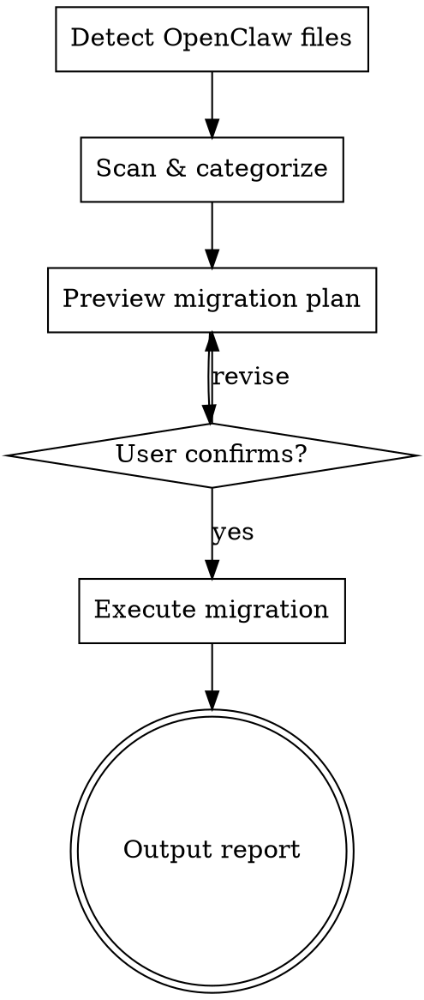

# Migrate OpenClaw to Claude Code

Converts an OpenClaw workspace into a fully functional Claude Code project. Scans all OpenClaw files, previews a migration plan, executes on confirmation, and reports results.

## Process



## Phase 1: Detect OpenClaw Files

Search for OpenClaw markers in this order. Stop at the first match:

1. **Current project directory** - look for `SOUL.md` + `AGENTS.md`, `openclaw.json`, or `.openclaw/` folder
2. **Default location** - check `~/.openclaw/workspace/` and `~/.openclaw/`
3. **GitHub repo** - if user provides a repo URL, clone to a temp directory first
4. **Ask** - if nothing found, ask the user for the path

Markers that confirm OpenClaw:
- `SOUL.md` alongside `AGENTS.md` or `USER.md`
- `openclaw.json`
- `.openclaw/workspace-state.json`

If the source is a GitHub URL:
```bash
git clone <url> /tmp/openclaw-migration-source
```
Use that as the source path. Clean up after migration.

## Phase 2: Scan & Categorize

Read every file in the OpenClaw source. Categorize each into one of three buckets:

### MIGRATE - These become part of Claude Code

| OpenClaw File | Destination | Method |
|---|---|---|
| `USER.md` | `KNOWLEDGE BASE/user.md` | Copy. Referenced from CLAUDE.md |
| `AGENTS.md` | `KNOWLEDGE BASE/rules.md` | Copy. Strip OpenClaw-specific rules (heartbeat, group chat routing, channel etiquette, gateway commands). Keep universal operating rules |
| `SOUL.md` | `KNOWLEDGE BASE/soul.md` | Copy as-is. On-demand, NOT auto-loaded |
| `IDENTITY.md` | `KNOWLEDGE BASE/identity.md` | Copy as-is |
| `TOOLS.md` | `KNOWLEDGE BASE/tools.md` | Copy if it contains useful environment notes |
| `HEARTBEAT.md` | `_openclaw_archive/` | Archive. Note in report that cron/heartbeat does not carry over |
| `BOOTSTRAP.md` | `_openclaw_archive/` | Archive. First-run ritual, not needed |
| `memory/*.md` | `KNOWLEDGE BASE/memory/` | Copy all memory files |
| `skills/*/SKILL.md` | `.claude/skills/*/SKILL.md` | Convert (see Skill Conversion below) |
| Secondary agent directories | `.claude/skills/<agent-name>/SKILL.md` | Convert to agent skill (see Agent Conversion below) |

### ARCHIVE - Moved to `_openclaw_archive/`

These are OpenClaw infrastructure files with no Claude Code equivalent:
- `openclaw.json` (gateway config)
- `credentials/` (WhatsApp, Telegram, Discord tokens)
- `agents/*/sessions/` (old chat transcripts)
- `devices/` (mobile node pairings)
- `logs/` (gateway logs)
- `.openclaw/` (internal state)
- `cron/` (scheduled job definitions)
- `BOOTSTRAP.md` (first-run ritual)
- `HEARTBEAT.md` (periodic task config)
- Channel-specific config files (e.g. `*-allowFrom.json`)
- `openclaw.json.bak`
- `update-check.json`

### SKIP - Not touched

- `.git/`
- Any files that are not OpenClaw-related

## Phase 3: Skill Conversion

OpenClaw skills and Claude Code skills are both markdown with YAML frontmatter. Conversion is straightforward:

1. Keep `name` and `description` from frontmatter
2. Strip `metadata.openclaw` block (requires.bins, requires.env, etc.)
3. If the skill had `requires.bins`, add a note at the top: "Requires: [tool names]"
4. If the skill had `requires.env`, add a note: "Environment variables needed: [var names]"
5. Keep all other content as-is
6. Write to `.claude/skills/<skill-name>/SKILL.md`

## Phase 4: Agent-to-Skill Conversion

OpenClaw users may have multiple agents. Each agent has its own personality.

**Main/primary agent** (usually named "main" or the only agent):
- Its `SOUL.md` goes to `KNOWLEDGE BASE/soul.md`
- Its `IDENTITY.md` goes to `KNOWLEDGE BASE/identity.md`
- No skill is created. The user invokes the soul file on demand.

**Secondary agents** (any agent that is not the primary):
Each becomes a Claude Code skill. Create `.claude/skills/<agent-name>/SKILL.md`:

```markdown
---
name: <agent-name>
description: Use when you need to respond as the <agent-name> agent. Invoke this personality for [purpose based on agent's soul/identity].
---

# <Agent Display Name>

## Personality
[Full contents of that agent's SOUL.md]

## Identity
[Contents of that agent's IDENTITY.md, if it exists]

## Operating Rules
[Agent-specific rules from its AGENTS.md, only if different from the main agent's rules]

## Voice & Style
[Any voice or tone reference files found in that agent's directory]
```

**How to identify agents:**
- Check `<source>/agents/` for subdirectories (use the detected source path, NOT a hardcoded `~/.openclaw/` path)
- Each subdirectory name is an agent ID
- The "main" agent (or the only agent) is the primary. All others are secondary.
- Check if each agent has its own SOUL.md, IDENTITY.md, AGENTS.md, or voice files
- Look for voice/tone files: `voice-reference.md`, `VOICE.md`, `*_VOICE.md`, or similar naming patterns

**Edge case:** If only one agent exists, no agent skills are created. Everything goes to KNOWLEDGE BASE.

## Phase 5: CLAUDE.md Generation

Generate a lean, reference-only CLAUDE.md. Do NOT inline soul, personality, or large content blocks. Only reference where files live.

```markdown
# [Project Name] - Claude Instructions

## User Profile
See `KNOWLEDGE BASE/user.md` for full user context and preferences.

## Operating Rules
See `KNOWLEDGE BASE/rules.md` for operating instructions and guidelines.

## Agent Personality
Your personality and behavioral guidelines are in `KNOWLEDGE BASE/soul.md`. Read this file when you need to adopt the agent's voice, tone, or persona.

[If identity.md exists:]
## Agent Identity
See `KNOWLEDGE BASE/identity.md` for agent name, identity, and avatar details.

[If tools.md was migrated:]
## Tools & Environment
See `KNOWLEDGE BASE/tools.md` for environment-specific notes and tool configurations.

[If custom skills were migrated:]
## Migrated Skills
The following OpenClaw skills were migrated to Claude Code:
[List each: - `<skill-name>` - <description from skill frontmatter>]

[If agent skills were created:]
## Agent Skills
The following agent personalities are available as skills:
[List each: - `<agent-name>` - <one-line description from the agent's soul>]

## Memory
Previous memory and session notes are stored in `KNOWLEDGE BASE/memory/`.
```

**Important:** If the user already has a CLAUDE.md in their project, do NOT overwrite it. Instead, append a `## Migrated from OpenClaw` section with the references above.

## Phase 6: Preview

Before executing anything, show the user the full migration plan:

```
OpenClaw Migration Preview
===========================

Source: [path or GitHub URL]

WILL MIGRATE:
  - USER.md → KNOWLEDGE BASE/user.md
  - SOUL.md → KNOWLEDGE BASE/soul.md
  - AGENTS.md → KNOWLEDGE BASE/rules.md (cleaned)
  - 2 custom skills → .claude/skills/
  - 3 memory files → KNOWLEDGE BASE/memory/
  - 1 secondary agent "content-writer" → .claude/skills/content-writer/

WILL ARCHIVE (to _openclaw_archive/):
  - openclaw.json
  - credentials/ (4 files)
  - sessions/ (12 transcripts)
  - logs/
  - [other infrastructure files]

WILL SKIP:
  - .git/

WILL CREATE:
  - CLAUDE.md (or append to existing)
  - KNOWLEDGE BASE/ directory structure

Proceed? (yes/no)
```

Wait for user confirmation before executing.

## Phase 7: Execute

Run the migration in this order:

1. Create `KNOWLEDGE BASE/` directory and subdirectories
2. Create `_openclaw_archive/` directory
3. Copy/convert MIGRATE files to their destinations
4. Move ARCHIVE files to `_openclaw_archive/`, preserving their original directory structure (e.g. `credentials/whatsapp/creds.json` becomes `_openclaw_archive/credentials/whatsapp/creds.json`)
5. Convert skills (strip OpenClaw metadata)
6. Convert secondary agents to skills
7. Generate or append to CLAUDE.md
8. If source was a GitHub clone, remove the temp directory

## Phase 8: Report

Output a final migration report:

```
Migration Complete
==================

Created:
  - CLAUDE.md with references to knowledge base
  - KNOWLEDGE BASE/soul.md (primary agent personality)
  - KNOWLEDGE BASE/user.md (user profile)
  - KNOWLEDGE BASE/rules.md (operating rules, cleaned)
  - KNOWLEDGE BASE/identity.md (agent identity)
  - KNOWLEDGE BASE/memory/ (X memory files)

Skills migrated:
  - .claude/skills/seo-analyzer/ (custom skill)
  - .claude/skills/email-writer/ (custom skill)

Agent skills created:
  - .claude/skills/content-writer/ (from secondary agent)

Archived:
  - X files moved to _openclaw_archive/
  - Delete this folder when you're confident everything migrated correctly.

Not carried over:
  - Channel integrations (WhatsApp, Telegram, Discord) - Claude Code operates via terminal
  - Heartbeat/cron jobs - use Claude Code's terminal for scheduled tasks
  - Multi-agent routing - invoke agent skills directly when needed
  - Soul is on-demand, not auto-loaded every message

Next steps:
  1. Review CLAUDE.md and adjust references to your preferences
  2. Check .claude/skills/ for your converted skills and agent personalities
  3. Read KNOWLEDGE BASE/soul.md when you want Claude to adopt your agent's personality
  4. Explore KNOWLEDGE BASE/ to verify all your important context was preserved
  5. Delete _openclaw_archive/ when ready
```

## Rules

- NEVER delete original OpenClaw files without archiving first
- NEVER overwrite an existing CLAUDE.md. Append to it.
- NEVER inline large content into CLAUDE.md. Always reference separate files.
- If a file's purpose is unclear, archive it rather than discarding it.
- If the OpenClaw workspace is a git repo, do NOT touch `.git/`
- Strip OpenClaw-specific concepts from rules: heartbeat scheduling, group chat routing, channel etiquette, gateway commands, device pairing, DM allowlists
- Preserve universal rules: communication style, language preferences, domain expertise, behavioral guidelines
